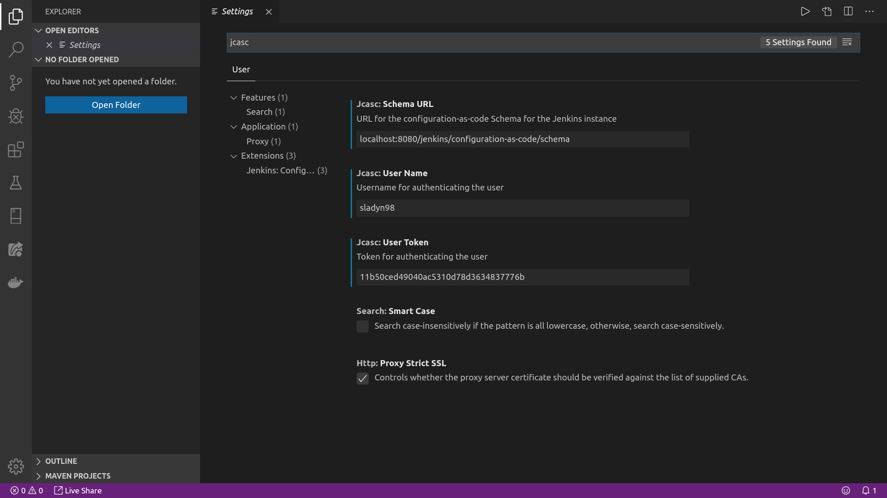
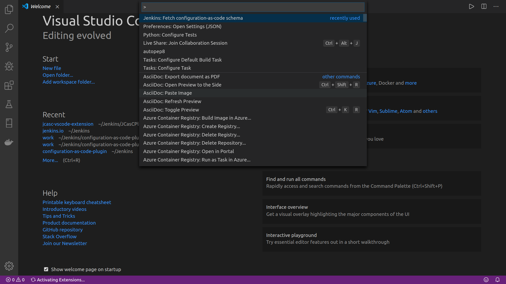

# JCasC-VSCode-Plugin

[](https://lgtm.com/projects/g/sladyn98/JCasC-VSCode-Plugin/alerts/)
[](https://dev.azure.com/jcasc-vscode-extension/jcasc-vscode-extension/_build/latest?definitionId=1&branchName=master)

## What does the plugin do

This plugin deals with the authentication and fetching of the JSON schema from a live Jenkins instance.
It provides the base for validation of yaml files written to configure a Jenkins instance.

## How to use

- Download and install the plugin from the VSCode Marketplace.
- Inside the Settings tab of VSCode find JCasc which will display two input blocks:

  - URL field for the Jenkins instance that you want to to extract the YAML Schema from.
    eg : `localhost:8080/jenkins`

  - User Token Field for if the Jenkins instance is protected.

- Once this is set you can use `Ctrl + Shift + P` to bring up the dialog box and then select the JCasC extension from the list of extensions, this will activate the extension.
- This will download the schema with the filename `jcasc-schema.json` to the current working directory.
- This schema file can then be used to autosuggest and validate the yaml file written for JCasC.

## User Guide

In order to enable validation we need to include it in the workspace settings. In order to do that
navigate to `File` and then `Preference` and then `Settings`. Inside settings search for `json` and inside `settings.json` include the following configuration.

```json
{
  "yaml.schemas": {
    "jcasc-schema.json": "y[a]?ml"
  }
}
```

You can specify a glob pattern as the value for schema.json which is the file name for the schema. This would apply the schema to all yaml files. eg: `.[y[a]?ml]`

The following tasks can be done using VSCode:

a) Auto completion (Ctrl + Space):
Auto completes on all commands.

b) Document Outlining (Ctrl + Shift + O):
Provides the document outlining of all completed nodes in the file.

Create a new file under the work directory called `jenkins.yml`. For example consider the following contents for the file:

```yaml
jenkins:
  systemMessage: “Hello World”
  numExecutors: 2
```

The above yaml file is valid according to the schema and vscode should provide you with validation and autocompletion for the same.

## Feature Overview

- JSON Schema Import
- Seamless connection to Jenkins instance
- Syntax Highlighting while writing yml
- Auto Suggestions

## How to Run Locally

1. Clone the repository.

2. Run `npm install` in the working directory.

3. Hit `F5` to run the plugin in the development Host.

## Settings

One can edit the settings in this window.

<p align="center">
  
</p>

## Extension Activation

This is the window to activate the extension.

<p align="center">
  
</p>
